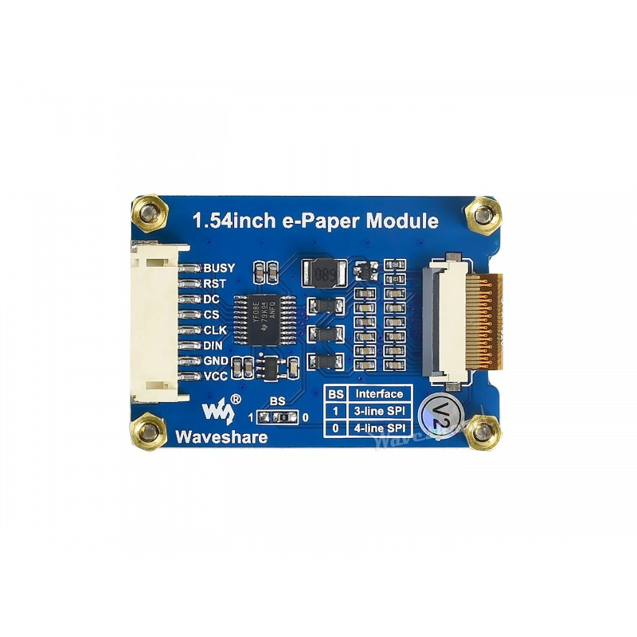

# Pico Metar
A small project to display Metar weather data on an Inland 1.54 inch e-ink
display via a Pi Pico W.

# How build??

```
WIFI_PASSWORD="" WIFI_SSID="" PICO_BOARD=pico_w cmake -B build/ ./
make -j$(nproc) -C build
```

## Pin Connections for Pico and E-Paper Display



## Pico Pin Layout


## Thanks To..

- Peter Harpers work on Pico W https examples https://github.com/peterharperuk/pico-examples
- Hammad Rauf's upload of Waveshare Eink code and pico example https://github.com/hammadrauf/pico_epd_1in54
